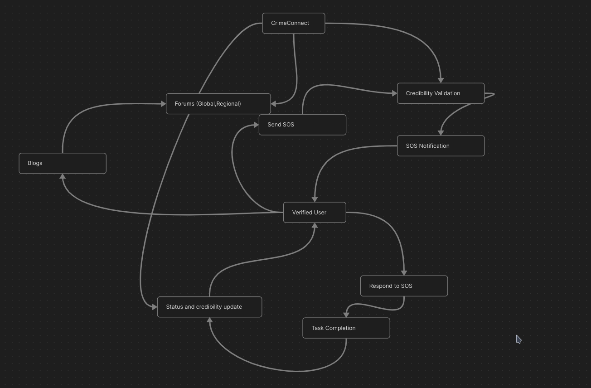
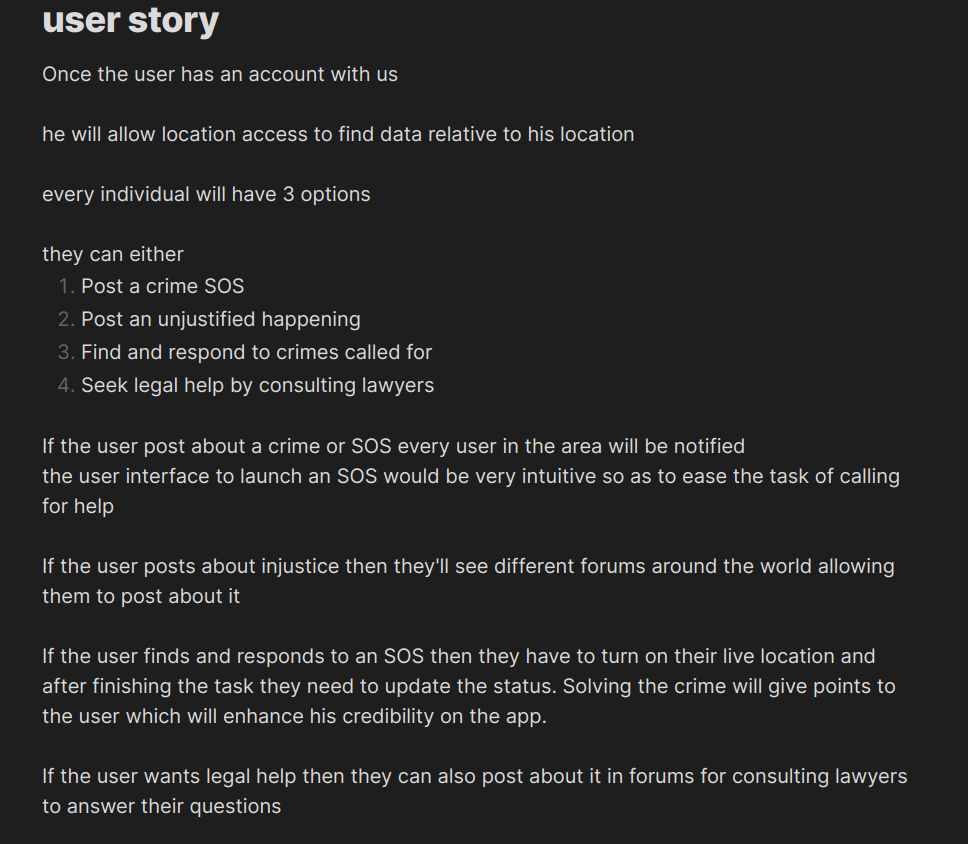

### Note from the developer

I started working on this project in my software development course but unfortunately my professor who was supervising this project left the college so I am writing this so as to explain my vision and idea with this app to the reader, for I wish to take a break from this app and work on more urgent things. I will be back to this project in the future. I hope you will be able to understand.

I believe to let the common man take responsibility of deliberately solving the crimes happening around him, helping the legal forces like spiderman and batman. But spiderman get updates about criminal activities from NYPD, how would a common man get that?

That's where this app comes into the picture. The victim directly alerts the vigilantes in the area. The vigilantes get an alarm if they accept it they get location of the crime. To avoid predators, a credibility system comes into the picture. This is the prime feature of this app. Whomever accepts the duty call will share their location and details automatically with everybody else who accepted including the victim, so that he/she knows who is coming to help and how far are they.

Other features I imagined were:
* **Rulebook** : Something which any user can refer to to quickly get a solution to a problem like hit and run cases etc.
* **Forums** : Forums to discuss about law and people to get human guidance related to any unjustified incident with the person.


If you wish to contribute into building this app, kindly refer to the following user story





Kindly refer to this [figma](https://www.figma.com/design/bWv4uN4rrtVRkOfDLxge8c/CrimeConnect?node-id=0-1&t=QRrIY4MR49WzZzdJ-1) drawing
if you wish to actively work on the app

In this, I haven't yet completed the UI so feel free to [mail me](mailto::sdidwania645@gmail.com) for suggestions.

# Welcome to your Expo app 👋

This is an [Expo](https://expo.dev) project created with [`create-expo-app`](https://www.npmjs.com/package/create-expo-app).

## Get started

1. Install dependencies

   ```bash
   npm install
   ```
2. Create an Appwrite.js in the root of the project
   ```js
      import { Client, Account,Databases,Storage, ID } from 'react-native-appwrite';

      const client = new Client()
         .setEndpoint('https://cloud.appwrite.io/v1')
         .setProject(<your-project-id>)
         .setPlatform(<your-android-package-name>);
         
      export const dbID = <your-database-id>
      export const auth = new Account(client)
      export const db = new Databases(client);
      export const storage = new Storage(client);
   ```

3. Start the app

   ```bash
    npx expo start
   ```

In the output, you'll find options to open the app in a

- [development build](https://docs.expo.dev/develop/development-builds/introduction/)
- [Android emulator](https://docs.expo.dev/workflow/android-studio-emulator/)
- [iOS simulator](https://docs.expo.dev/workflow/ios-simulator/)
- [Expo Go](https://expo.dev/go), a limited sandbox for trying out app development with Expo

You can start developing by editing the files inside the **app** directory. This project uses [file-based routing](https://docs.expo.dev/router/introduction).

## Get a fresh project

When you're ready, run:

```bash
npm run reset-project
```

This command will move the starter code to the **app-example** directory and create a blank **app** directory where you can start developing.

## Learn more

To learn more about developing your project with Expo, look at the following resources:

- [Expo documentation](https://docs.expo.dev/): Learn fundamentals, or go into advanced topics with our [guides](https://docs.expo.dev/guides).
- [Learn Expo tutorial](https://docs.expo.dev/tutorial/introduction/): Follow a step-by-step tutorial where you'll create a project that runs on Android, iOS, and the web.

## Join the community

Join our community of developers creating universal apps.

- [Expo on GitHub](https://github.com/expo/expo): View our open source platform and contribute.
- [Discord community](https://chat.expo.dev): Chat with Expo users and ask questions.
